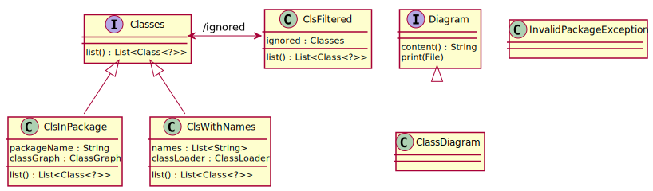

= eo-plantuml-builder

EO implementation of plantuml-builder

== Badges

=== Other

image::https://www.elegantobjects.org/badge.svg[Elegant Objects]
image::https://www.elegantobjects.org/intellij-idea.svg[intellij-idea]
https://www.rultor.com/p/yegor256/rultor[image:https://www.rultor.com/b/yegor256/rultor[DevOps
By Rultor.com]]

https://hitsofcode.com/view/github/RoRoche/eo-plantuml-builder[image:https://hitsofcode.com/github/RoRoche/eo-plantuml-builder[Hits-of-Code]]

== Class diagram

[source,plantuml]
----
include::diagrams/class_diagram.plantuml[]
----

== Credits

Built on top of awesome libraries:

* https://github.com/jboz/plantuml-builder
* https://github.com/ronmamo/reflections

== Icon credits

Icons made by https://www.flaticon.com/authors/eucalyp[Eucalyp] from
https://www.flaticon.com/[www.flaticon.com]

== About me

image::https://img.shields.io/twitter/follow/RRochegude?label=Follow%20me%20%40RRochegude&style=social[Twitter Follow]
image::https://img.shields.io/badge/LinkedIn-Romain%20Rochegude-blue?style=social&logo=linkedin[LinkiedIn, link=https://fr.linkedin.com/in/romain-rochegude-4750503b]